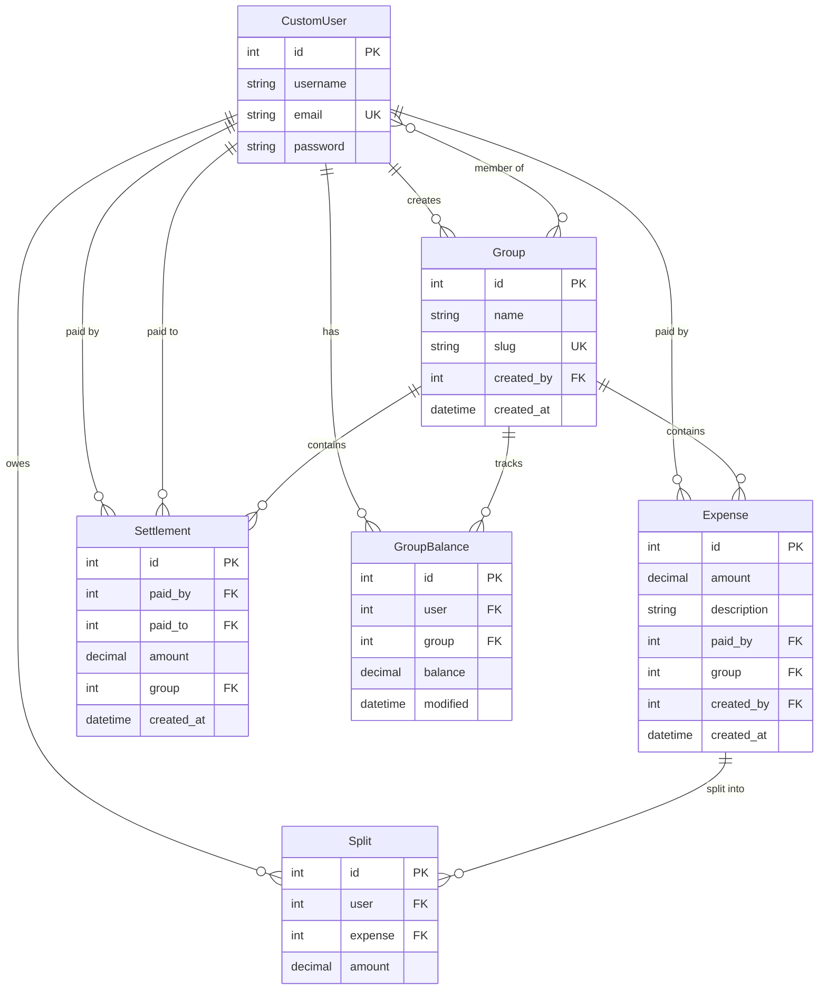

# 💸 Splitsy

A modern, full-stack expense-splitting application — built to learn real-world distributed architecture.

> **Splitsy** is the evolved rewrite of [Split Wisely](https://github.com/RubeshChandar/split-wisely), rebuilt from the ground up with a microservices-inspired architecture using **Next.js**, **Django REST Framework**, **FastAPI**, **Celery**, **Redis**, **PostgreSQL**, **Nginx**, and **Docker**.

<!-- 🔗 Live Demo: https://splitsy.rubeshchandar.com -->

---

## 🏗️ Architecture

```
                         ┌──────────────────┐
                         │      Nginx       │
                         │  (API Gateway &  │
                         │  Reverse Proxy)  │
                         └────────┬─────────┘
                ┌─────────────────┼─────────────────┐
                ▼                 ▼                  ▼
        ┌──────────────┐  ┌─────────────┐  ┌────────────────┐
        │   Next.js    │  │   Django    │  │    FastAPI      │
        │   (BFF +     │  │    DRF     │  │  Notifications  │
        │    React)    │  │  Core API  │  │  + Debt Engine  │
        │   :3000      │  │   :8000    │  │     :8001       │
        └──────┬───────┘  └─────┬──────┘  └───────┬─────────┘
               │                │                  │
               │          ┌─────┴──────┐           │
               │          ▼            ▼           │
               │      Postgres      Celery         │
               │                      │            │
               └──────────────►  Redis  ◄──────────┘
                                   │
                                Flower
                            (Task Monitor)
```

---

## ✨ Features

### 💰 Core — Expense & Group Management

- Create and manage expense groups
- Add expenses with flexible split options (equal, exact, percentage)
- Real-time group balances and transaction history
- Settle debts between members
- Member management with search and invite

### 🧮 Smart Debt Simplification

- Graph-based minimum cash flow algorithm (NetworkX)
- Reduces N transactions to the mathematical minimum
- Extracted as a standalone FastAPI compute service

### 🔔 Real-Time Notifications

- WebSocket-powered live updates via FastAPI
- Instant alerts when expenses are added or debts are settled
- Redis pub/sub for cross-service event propagation

### 🔁 Background Processing

- Celery workers for async balance recalculation
- Triggered on every expense/settlement create, update, or delete
- Atomic transactions with `select_for_update` for consistency
- Monitored via Flower dashboard

### 🔐 Authentication

- JWT-based auth (access + refresh tokens)
- Django handles user management and token issuance
- Next.js middleware for route protection
- Secure HTTP-only cookie storage

### 📦 Caching

- Redis caching for computed group balances
- Automatic cache invalidation after Celery task completion
- Next.js server-side caching with revalidation

---

## 🛠️ Tech Stack

| Layer                | Technology              | Purpose                                  |
| -------------------- | ----------------------- | ---------------------------------------- |
| **Frontend**         | Next.js 15 (App Router) | React SSR/CSR, BFF, Server Components    |
| **Core API**         | Django 5 + DRF          | REST API, ORM, Auth, Admin, Celery tasks |
| **Microservice**     | FastAPI                 | WebSockets, Debt engine, Async endpoints |
| **Task Queue**       | Celery + Redis          | Background balance recalculation         |
| **Task Monitor**     | Flower                  | Celery task monitoring dashboard         |
| **Database**         | PostgreSQL              | Primary relational data store            |
| **Cache / Broker**   | Redis                   | Caching, Celery broker, Pub/Sub          |
| **Reverse Proxy**    | Nginx                   | API gateway, routing, static files, SSL  |
| **Containerization** | Docker Compose          | Multi-service orchestration              |

---

## 📁 Project Structure

```
splitsy/
├── frontend/                    # Next.js (React)
│   ├── src/
│   │   ├── app/                 # App Router pages
│   │   │   ├── (auth)/          # Login, Register (public)
│   │   │   ├── dashboard/       # Home dashboard
│   │   │   ├── groups/          # Group views
│   │   │   │   └── [slug]/      # Single group detail
│   │   │   └── layout.tsx       # Root layout
│   │   ├── components/          # Reusable UI components
│   │   ├── lib/                 # API client, utilities
│   │   └── middleware.ts        # Auth middleware
│   ├── public/
│   ├── next.config.js
│   └── package.json
│
├── backend/                     # Django + DRF
│   ├── config/                  # Django project settings
│   │   ├── settings.py
│   │   ├── urls.py
│   │   ├── celery.py
│   │   └── wsgi.py
│   ├── apps/
│   │   ├── users/               # Custom user model, JWT auth
│   │   ├── groups/              # Group CRUD + member management
│   │   ├── expenses/            # Expense + Split models & API
│   │   └── settlements/         # Settlement model & API
│   ├── manage.py
│   └── requirements.txt
│
├── services/
│   └── notifications/           # FastAPI microservice
│       ├── main.py              # WebSocket + Debt engine endpoints
│       ├── debt_engine.py       # Min-cost flow algorithm
│       ├── requirements.txt
│       └── Dockerfile
│
├── nginx/
│   ├── nginx.conf               # Routing rules
│   └── Dockerfile
│
├── docker-compose.yml           # All services orchestrated
├── docker-compose.prod.yml      # Production overrides
├── .env.example
├── Makefile                     # Common commands
└── README.md
```

---

## 🚦 Nginx Routing

| Path        | Destination     | Description           |
| ----------- | --------------- | --------------------- |
| `/`         | Next.js `:3000` | React frontend (SSR)  |
| `/api/v1/*` | Django `:8000`  | Core REST API         |
| `/ws/*`     | FastAPI `:8001` | WebSocket connections |
| `/admin/`   | Django `:8000`  | Django admin panel    |
| `/flower/`  | Flower `:5555`  | Celery task monitor   |

---

## 🚀 Getting Started

### Prerequisites

- [Docker](https://www.docker.com/) & Docker Compose
- [Node.js 20+](https://nodejs.org/) (for local frontend dev)
- [Python 3.11+](https://www.python.org/) (for local backend dev)

### Quick Start (Docker)

```bash
# Clone the repository
git clone git@github.com:RubeshChandar/splitsy.git
cd splitsy

# Copy environment variables
cp .env.example .env

# Build and start all services
docker compose up --build

# Access the application
# Frontend:       http://localhost
# Django API:     http://localhost/api/v1/
# Django Admin:   http://localhost/admin/
# Flower:         http://localhost/flower/
# FastAPI Docs:   http://localhost:8001/docs
```

### Local Development

<details>
<summary><b>Frontend (Next.js)</b></summary>

```bash
cd frontend
npm install
npm run dev
# → http://localhost:3000
```

</details>

<details>
<summary><b>Backend (Django)</b></summary>

```bash
cd backend
python -m venv .venv
source .venv/bin/activate
pip install -r requirements.txt

python manage.py migrate
python manage.py createsuperuser
python manage.py runserver
# → http://localhost:8000
```

</details>

<details>
<summary><b>Notifications Service (FastAPI)</b></summary>

```bash
cd services/notifications
pip install -r requirements.txt
uvicorn main:app --reload --port 8001
# → http://localhost:8001/docs
```

</details>

<details>
<summary><b>Celery Worker</b></summary>

```bash
cd backend
celery -A config worker -l info
```

</details>

---

## 🗄️ Data Models



---

## 🔁 Balance Recalculation Flow

```
  User Action (Add Expense / Settle Debt)
          │
          ▼
  ┌───────────────┐
  │  Django API   │──── saves to ──── PostgreSQL
  │  (DRF View)   │
  └───────┬───────┘
          │ Signal triggers
          ▼
  ┌───────────────┐
  │ Celery Task   │──── update_group_balance
  │ (Redis Queue) │
  └───────┬───────┘
          │
          ▼
  ┌───────────────────────────────────────┐
  │  1. Aggregate expenses (paid_by)     │
  │  2. Aggregate splits (user share)    │
  │  3. Aggregate settlements (in/out)   │
  │  4. net = paid - share + out - in    │
  │  5. bulk_update / bulk_create        │
  │  6. Invalidate Redis cache           │
  │  7. Publish event (Redis pub/sub)    │
  └───────────────────┬───────────────────┘
                      │
                      ▼
              ┌───────────────┐
              │   FastAPI     │──── pushes via WebSocket
              │ Notification  │     to connected clients
              └───────────────┘
```

---

## 🧮 Debt Simplification Algorithm

Splitsy uses a **minimum-cost flow** algorithm (via NetworkX) to simplify group debts:

```
Before simplification:         After simplification:
  A ──$10──▶ B                   A ──$10──▶ C
  B ──$20──▶ C
  A ──$10──▶ C                 (3 transactions → 1)
```

> The algorithm models each user as a node with supply/demand equal to their net balance, then finds the minimum set of transactions to settle all debts.

---

## 📡 API Endpoints

### Auth

| Method | Endpoint                 | Description          |
| ------ | ------------------------ | -------------------- |
| `POST` | `/api/v1/auth/register/` | Register new user    |
| `POST` | `/api/v1/auth/login/`    | Obtain JWT tokens    |
| `POST` | `/api/v1/auth/refresh/`  | Refresh access token |

### Groups

| Method   | Endpoint                            | Description               |
| -------- | ----------------------------------- | ------------------------- |
| `GET`    | `/api/v1/groups/`                   | List user's groups        |
| `POST`   | `/api/v1/groups/`                   | Create new group          |
| `GET`    | `/api/v1/groups/:slug/`             | Group detail + balances   |
| `DELETE` | `/api/v1/groups/:slug/`             | Delete group (admin only) |
| `POST`   | `/api/v1/groups/:slug/members/`     | Add member                |
| `DELETE` | `/api/v1/groups/:slug/members/:id/` | Remove member             |

### Expenses

| Method   | Endpoint                         | Description             |
| -------- | -------------------------------- | ----------------------- |
| `GET`    | `/api/v1/groups/:slug/expenses/` | List group expenses     |
| `POST`   | `/api/v1/groups/:slug/expenses/` | Add expense with splits |
| `DELETE` | `/api/v1/expenses/:id/`          | Delete expense          |
| `GET`    | `/api/v1/expenses/:id/splits/`   | View expense splits     |

### Settlements

| Method   | Endpoint                            | Description       |
| -------- | ----------------------------------- | ----------------- |
| `GET`    | `/api/v1/groups/:slug/settlements/` | List settlements  |
| `POST`   | `/api/v1/groups/:slug/settlements/` | Record settlement |
| `DELETE` | `/api/v1/settlements/:id/`          | Delete settlement |

### Debt Engine (FastAPI)

| Method | Endpoint                          | Description                |
| ------ | --------------------------------- | -------------------------- |
| `GET`  | `/ws/notifications/`              | WebSocket connection       |
| `POST` | `/api/v1/compute/simplify-debts/` | Calculate min transactions |

---

## 🐳 Docker Services

| Service         | Image         | Port        | Description                 |
| --------------- | ------------- | ----------- | --------------------------- |
| `nginx`         | Custom        | `80`, `443` | Reverse proxy & API gateway |
| `frontend`      | Node 20       | `3000`      | Next.js application         |
| `backend`       | Python 3.11   | `8000`      | Django REST API             |
| `notifications` | Python 3.11   | `8001`      | FastAPI microservice        |
| `postgres`      | PostgreSQL 16 | `5432`      | Database                    |
| `redis`         | Redis Alpine  | `6379`      | Cache & message broker      |
| `celery`        | Python 3.11   | —           | Background task worker      |
| `flower`        | Python 3.11   | `5555`      | Task monitoring UI          |

---

## 🧪 Running Tests

```bash
# Backend tests
cd backend
python manage.py test

# Frontend tests
cd frontend
npm run test

# FastAPI tests
cd services/notifications
pytest
```

---

## 🗺️ Roadmap

- [x] Project architecture & scaffolding
- [ ] Django DRF — Core API (Users, Groups, Expenses, Settlements)
- [ ] JWT Authentication with refresh tokens
- [ ] Celery balance recalculation task
- [ ] Next.js — Frontend (Auth, Dashboard, Group pages)
- [ ] FastAPI — Debt simplification engine
- [ ] FastAPI — WebSocket notifications
- [ ] Nginx reverse proxy & API gateway
- [ ] Docker Compose full orchestration
- [ ] Currency selection support
- [ ] Activity feed & expense history
- [ ] Email notifications
- [ ] CI/CD pipeline
- [ ] Production deployment

---

## 📌 Evolved From

This project is a complete rewrite of [**Split Wisely**](https://github.com/RubeshChandar/split-wisely) — originally built as a monolithic Django + HTMX application. Splitsy takes the same core concept and rebuilds it with a modern, distributed architecture for learning purposes.

## 📄 License

This project is licensed under the [MIT License](./LICENCE) © 2025 Rubeshchandar Rajkumar.
